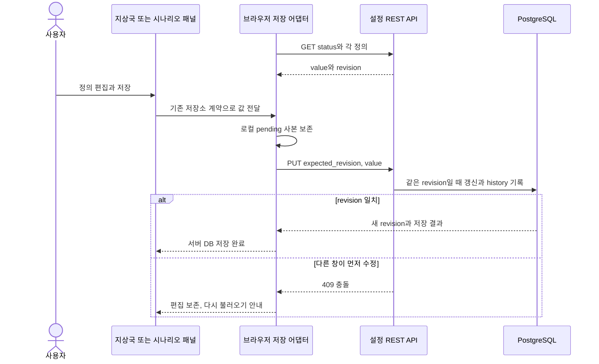

# 지상국과 시나리오 정의 저장

지상국과 직접 작성한 시험 시나리오는 공유할 수 있는 **정의**다. 실행 중인 SIM, 수락 배치, 텔레메트리는 별도의 **현재 상태**다. 현재 DB 연결은 두 정의만 저장하며, DB를 설치했다고 실행 중인 상태까지 재시작 후 복원되는 것은 아니다.

| 자료 | 저장 위치와 책임 |
|---|---|
| `ground_stations` | PostgreSQL JSONB: 지상국 정의와 revision |
| `scenario_drafts` | PostgreSQL JSONB: 작성 시나리오와 revision |
| 편집 중 사본 | 브라우저 저장소와 `.pending-postgresql` 복구용 사본 |
| 최초 이관 전 자료 | `.before-postgresql` 브라우저 백업 |
| SIM 실행, 배치 수락, 계산 결과 | 기존 runtime 및 계산 소유자. 이번 정의 DB의 저장 대상이 아님 |

## 편집부터 저장까지

로컬 편집 수락과 서버 저장 완료는 서로 다른 상태다. 화면의 불러오는 중·저장 중·완료·실패를 확인한다. 충돌 후 다른 사용자의 값을 자동으로 덮어쓰지 않는다. 최초 읽기 동안 편집했다면 그 내용을 보존하고 오류를 알린다. DB 미구성이면 브라우저에만 저장된다고 표시한다.

## 인터페이스와 실패

| API | 계약 |
|---|---|
| `GET /api/workspace/configurations/status` | 연결 사용 여부, provider와 지원 kind |
| `GET /api/workspace/configurations/{kind}` | `value`, `revision`, `updated_at` |
| `PUT /api/workspace/configurations/{kind}` | `expected_revision`과 `value`. `X-ISDC-Configuration: 1` 필요 |

지원 kind는 위 두 가지다. 미지원 kind는404, 다른 Origin 또는 헤더 누락은403, revision 충돌은409, DB 미구성·접속 불가는503, 정의 도메인 오류는400으로 구분한다. 이 same-origin 보호는 사용자별 권한 관리 시스템이 아니다. DB 자격증명은 브라우저로 전달하지 않는다.

정의와 변경 이력은 같은 트랜잭션으로 저장한다. 데이터 크기와 필드 범위를 검증하며 지상국은 최대24개, 작성 시나리오는 최대48개다. DB 연결은 factory에 주입하며 기존 ICD-06의 외부 시험결과 DB 메시지 `VF-04`를 구현한 것으로 해석하지 않는다.

## 근거와 공유 범위

[ADR0065](../../project_support/docs/adr/0065_postgresql_workspace_definitions.md)에는 실제 두 정의 저장·새로고침·격리 백업 복원 기록이 있다. 현재 작업에서 운영 DB에 새 값을 쓰거나 복원하지는 않았다. 자동 DB 시험은 명시적인 `ISDC_TEST_DATABASE_CONFIG`가 없으면 건너뛴다.

소스: [브라우저 저장](../../user_application/web/scripts/workspace_configuration.js), [REST 계약](../../communication/http/workspace_configuration.py), [트랜잭션과 검증](../../data/workspace_configuration.py), [시험](../../project_support/tests/test_workspace_configuration.py).

관련 문서: [ICD와 실행 계약](../interfaces/icd.md), [DT 시험](../screens/scenarios-settings.md), [전체 구조](runtime-flow.md).
