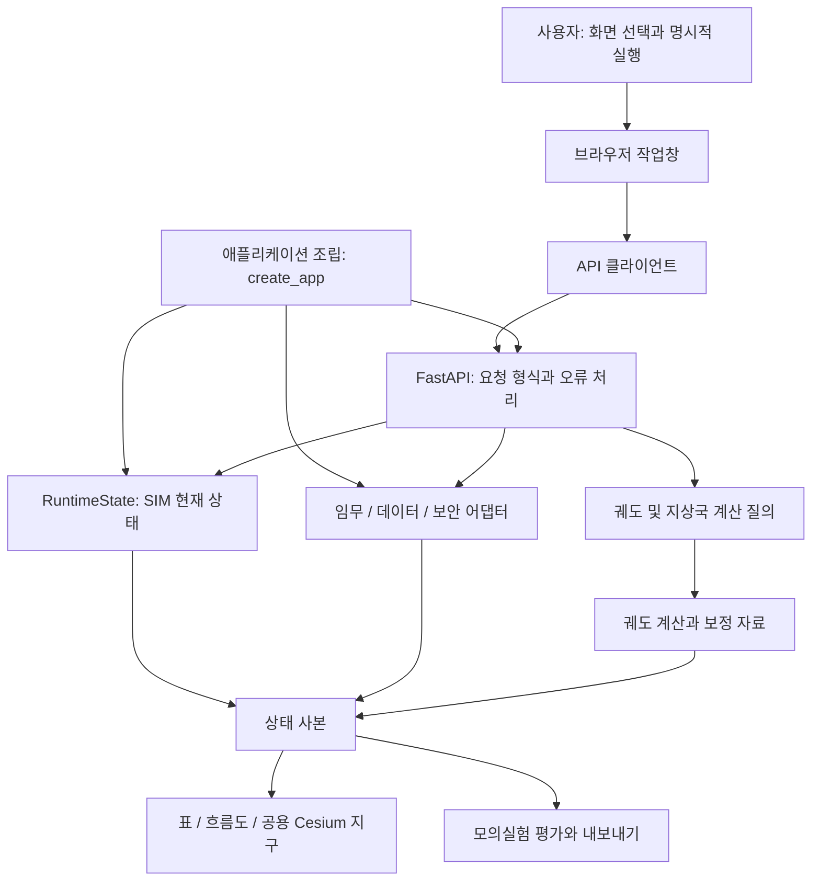
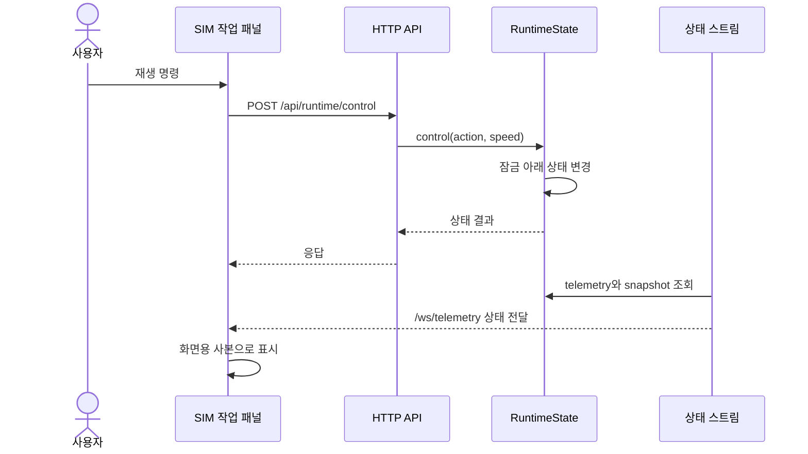
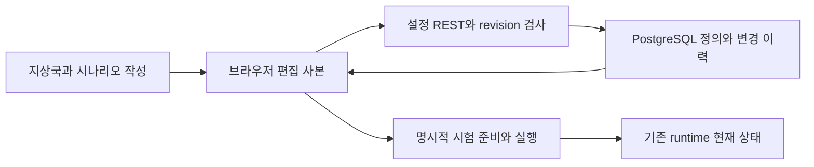

# 전체 구조와 상태 흐름

이 프로그램은 브라우저 화면, Python API, 궤도 및 모의 계산을 조립한 독립 ISDC 디지털 트윈이다. 화면이 계산 결과를 보여준다는 것과 실제 위성으로부터 값을 받았다는 것은 다르다. 먼저 결과가 어디서 왔는지 구분해야 한다.

## 세 가지 자료를 구분하기

| 자료 | 의미 | 해석할 때 주의할 점 |
|---|---|---|
| 카탈로그와 저장 궤도 입력 | 궤도요소와 보정 자료로 계산한 위치 | 실시간 수신 위치가 아니다. UTC와 자료 유효기간을 확인한다 |
| 배치 노드와 SIM | 구성한 가상 위성, 통신 및 임무의 모의 결과 | 모델 가정에 따른 값이다 |
| 관제 상황판 | 운용 상태를 요약하는 표면 | 실제 원격측정이 없으면 관련 수치는 미확인으로 남는다 |

## 실행 구조

`user_application/web/application.py`의 `create_app`이 실행 객체와 HTTP 라우터를 연결한다. `communication/http`는 요청을 해석하고 주입된 객체를 호출한다. 계산과 실행 상태를 HTTP 계층 자체에 보관하는 구조는 아니다. 실제 책임 배치는 [공동 개발 규칙](../../project_support/docs/DEVELOPMENT.md)에 정리돼 있다.

## 화면 버튼에서 결과까지: SIM 재생 예

WebSocket은 서버의 모의 상태와 평가를 반복해서 전달한다. 이름이 `telemetry`여도 이것만으로 실제 위성 원격측정 연결을 뜻하지 않는다. 스트림의 코드는 [telemetry.py](../../communication/http/telemetry.py), 명령 경로는 [runtime.py](../../communication/http/runtime.py)에서 확인할 수 있다.

## 누가 상태를 소유하는가

SIM 현재 상태는 `RuntimeState`가 소유하며 상태를 바꾸는 명령은 잠금으로 보호한다. 임무, 데이터, 보안에는 별도 계약과 어댑터가 연결되므로 모든 자료를 단일 SIM 값으로 환원하면 안 된다. 브라우저 패널과 지구는 결과 사본을 표시한다.

화면 조립은 [workspace_orbit.js](../../user_application/web/scripts/workspace_orbit.js)가 맡는다. 이 파일은 기존 패널, 공용 지구, 노드, 카탈로그, 시계와 상태 투영을 연결한다. 메뉴 전환을 맡는 [workspace.js](../../user_application/web/scripts/workspace.js)와 역할이 다르다. 새 화면은 새 서버 상태를 만드는 대신 기존 소유 객체의 자료를 전달받도록 확장한다.

공용 시각에는 궤도 자료, 노드, 카탈로그와 SIM의 출처가 함께 연결된다. 같은 숫자처럼 보이는 UTC라도 소유 자료가 다를 수 있다. 자료 유효기간 오류를 없애려고 임의로 현재 시각이나 오래된 성공값을 덮어쓰지 않는다.

## 오류를 읽는 법

## 2026-10-08 추가된 정의 저장 경계

현재 factory는 주입된 `workspace_configuration` 저장소와 설정 REST 라우터도 조립한다. [지상국과 시나리오 정의 저장](definition-storage.md)은 PostgreSQL에 작성 정의를 보관하는 기능이며 RuntimeState의 실행 상태 저장과 구분한다. 화면은 브라우저 사본을 편집하고 서버 revision으로 저장 충돌을 확인한다.

모듈 간 메시지, UTC와 SIM 경과 초, 진단 주소와 실제 전송 주소의 차이는 [ICD 인터페이스 명세](../interfaces/icd.md)에서 설명한다.

## 오류 해석

입력 형식 오류, 계산 자료의 유효기간 오류, 모듈 응답 실패는 서로 다른 문제다. HTTP 형식 검증과 도메인 오류 처리, 계산의 현재성 검사, 패널의 오류 표시는 각 경계에서 수행한다. 모의 통신 성공은 실제 RF 수신이나 장비 연동 성공의 증거가 아니다.

다음으로 [위성과 지상국](../screens/satellite-ground.md), [DT 시험과 설정](../screens/scenarios-settings.md)을 읽으면 이 구조가 실제 화면에 어떻게 나타나는지 볼 수 있다.
