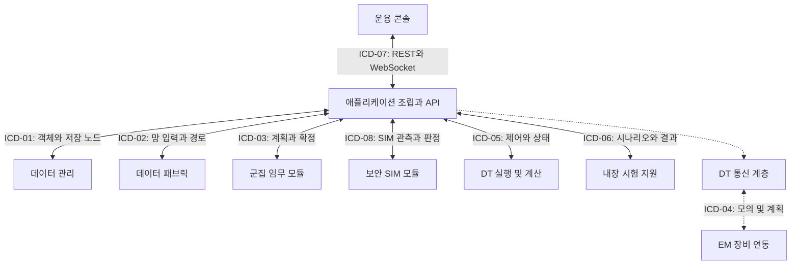
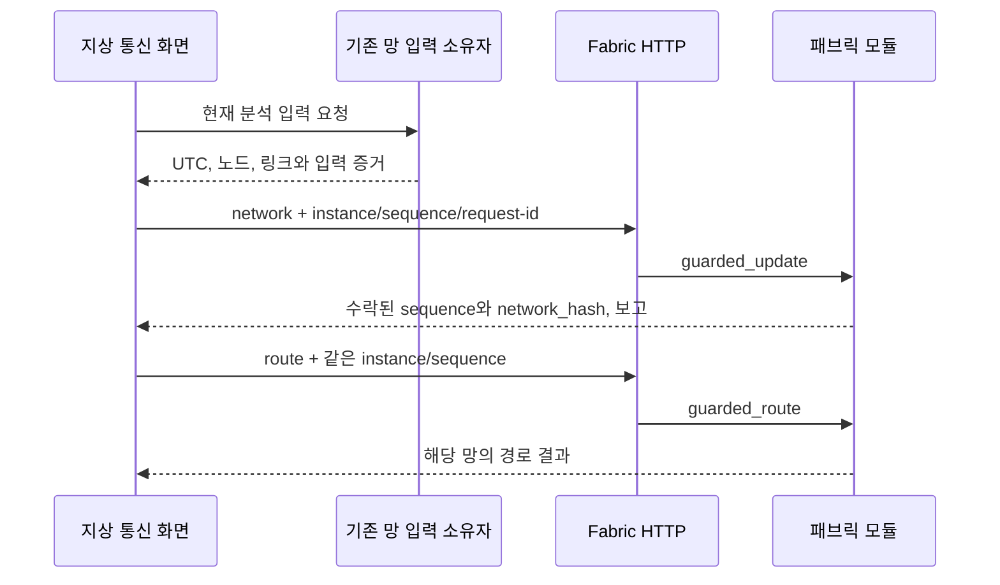
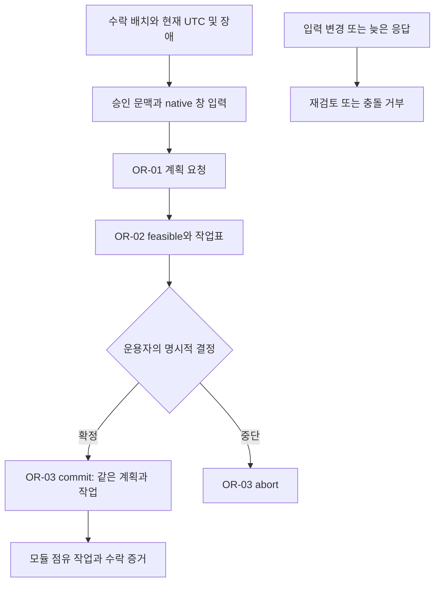

# ICD 인터페이스 명세와 실행 계약

ICD는 서로 다른 모듈이 **무슨 자료를, 어떤 형식과 시간 기준으로 주고받는지** 합의하는 인터페이스 명세다. 예를 들어 통신망 계산 결과를 패브릭에 보내려면 노드와 링크의 구조, 분석 UTC, 요청 순서, 실패 결과가 맞아야 한다. 위키는 현재 코드의 계약을 설명하며 새 ICD를 승인하는 문서가 아니다.

화면에서는 **시스템 → 시스템 연동 설정 → 인터페이스 명세**에서 원본 목록을 읽는다. 원본 내부 이름은 `ICD`다. 연결도는 모듈 관계, 연결 목록은 주소와 진단, 인터페이스 명세는 메시지 방향과 상태를 보여준다.

## 전체 연결 지도

이 그림은 기능 경계다. 모든 화살표에 독립 네트워크 서버가 떠 있다는 뜻은 아니다. 내장 모듈은 주입된 객체를 호출하고 원격 모듈은 별도 HTTP 어댑터를 사용한다.

## 8개 명세의 현재 위치

버전과 승인 상태는 [원본 카탈로그](../../user_application/web/scripts/settings/topology.js)의 기록이다. 카탈로그의 날짜·속도·크기 표시는 실제 V6의 모든 경로에서 측정한 성능 보장이 아니다. 특히 오래된 설명의 브라우저 계산 표현은 현재 native 승인 경로와 함께 읽어야 한다.

| 명세 / 카탈로그 버전 | 역할 | 현재 실행 근거 | 남은 범위 |
|---|---|---|---|
| ICD-01 / 1.4 승인 | 객체 등록, 저장 배치, 복제와 서비스 | scope를 분리한 데이터 API와 내장 SIM 모듈 | 실제 분산 저장 장비·파일 무결성의 실측 |
| ICD-02 / 2.0 승인 | 링크 품질, 경로, DTN 저장 전달 | 망 갱신·경로·상태 API, guarded 교환 | DF-06 개별 번들 상태는 계획. 실제 OISL/RF가 아님 |
| ICD-03 / 1.1 검토 | 군집 임무 편성·확정·중단 | 다섯 임무 종류, guarded plan/commit와 승인 문맥 | OR-05 모듈 자발 상태 보고는 계획. 다섯 종류 전체 live 수용은 별도 |
| ICD-04 / 0.9 초안 | DT와 EM 장비 사이 명령·상태 | MOCK-HIL 조작과 SIM 상태 | 실제 탑재 프로토콜, 송수신 제어·갱신·하트비트는 미검증/계획 |
| ICD-05 / 1.4 승인 | 모델 배치, SIM 제어, 상태와 계산 입력 | 기존 runtime·배치·계산 API와 스트림 | 독립 장비용 wire 프로토콜이 아님 |
| ICD-06 / 1.0 검토 | 시험 정의, KPI 표본, 결과 기록 | 내장 시나리오 runner와 결과 내보내기 | VF-04 외부 시험결과 DB/분석 전달은 계획 |
| ICD-07 / 1.1 승인 | 콘솔 제어와 상태 수신 | REST 및 `/ws/telemetry` | 수신 값은 현재 SIM. 실제 위성 텔레메트리로 확대하지 않음 |
| ICD-08 / 1.0 초안 | 보안 관측과 규칙 판정 | 계약1.0 SIM 관측·판정·전환 이력·상태 | 실제 암호화, 인증 장비, 침입 탐지·영구 감사가 아님 |

PostgreSQL의 지상국·시나리오 **정의 저장**은 새 설정 API다. 이를 VF-04의 시험결과 DB 구현으로 합산하지 않는다. [저장 범위](../architecture/definition-storage.md)를 참고한다.

## ICD-01: 데이터를 어디에 보관하는가

패브릭이 전달 경로를 다루는 동안 데이터 관리는 객체의 배치·복제·상태를 다룬다.

| 메시지 | 실제 API 또는 보고 | 중요한 입력과 결과 |
|---|---|---|
| DM-01 수집 등록 | POST `/api/data-management/ingest` | `products`: ref, class, source, size_mb, priority |
| DM-02 서비스 요청 | POST `/api/data-management/requests` | object_id 또는 class, destination, requester |
| DM-03 운영 조치 | POST `/api/data-management/actions` | verify/heal/rebalance/set_replication/set_filter/purge_expired |
| DM-04 저장 노드 갱신 | POST `/api/data-management/nodes` | id, kind, capacity_gb, available |
| DM-05~08 조회 | GET overview/objects/nodes/events | 점수와 객체·노드·사건 사본 |
| DM-09 모듈 상태 | GET `/api/data-management/status` | 구현, 배치, 주소, scope 계약 |

직접 ICD 쓰기는 `scope_id`, `time`, `sim_elapsed_s`를 전달한다. 스키마에서 scope가 선택 필드처럼 보여도 HTTP 어댑터는 직접 ICD 요청의 누락을409로 거부한다. 별도 실행·배치의 자료가 섞이지 않게 하는 `isolated-v1` 경계다. `time` 문자열과 SIM 경과 초를 같은 시계로 오해하지 않는다.

화면용 `GET /api/data-management/dashboard`는 단순 정적 조회와 다르다. 현재 수락 배치와 SIM 입력을 바탕으로 모듈에 전달한 보고를 합친다. `/console/request`, `/console/action`은 사용자 명령 경로이며 현재 문맥을 검사하고 서버가 시간을 붙인다.

소스: [스키마](../../communication/http/data_management_schemas.py), [라우터](../../communication/http/data_management.py), [데이터 화면](../screens/data-security.md).

## ICD-02: 이 망으로 전달할 수 있는가

`POST /api/data-fabric/network`의 입력은 `time`, `nodes`, `links`다. 노드는 satellite/ground를 구분하고 generation_mbps, storage_gb, extra_delay_ms를 가진다. 링크는 a/b, oisl/ground/terrestrial, state와 faulted를 전달한다. 최대 노드2000개·링크20000개이며 이 숫자는 요청 상한이지 처리 성능 보장이 아니다.

| 메시지 | API와 결과 |
|---|---|
| DF-01 → DF-02 | network POST → usable, 품질과 사유, 지상 경로와 저장 전달 보고 |
| DF-03 → DF-04 | route POST: source, target, objective(latency/reliability/balanced) → 경로 상태와 결과 |
| DF-05 | status GET → instance, sequence, 갱신 시각과 실제 배치 |
| DF-06 | 개별 DTN 번들 보고는 계획 항목 |

guarded 헤더는 `X-ISDC-Fabric-Instance`, `Sequence`, `Request-Id`다. network에는 request-id가 필요하며 route는 같은 모듈·순번의 망에서 질의한다. 헤더가 아예 없는 원본 호환 경로도 남아 있으므로 모든 요청이 자동으로 guarded라고 주장하지 않는다. 충돌409, 모듈 불가503을 구분한다.

지상 화면의 주기 조회와 과거 품질 이력은 새로운 정확 입력 전송 승인과 구분한다. 과거 기하나 과거 성공 보고를 현재 링크 품질로 대체하지 않는다.

소스: [wire 스키마](../../communication/http/data_fabric_schemas.py), [헤더와 라우터](../../communication/http/data_fabric.py), [교환 시험](../../project_support/tests/test_data_fabric_guards.py).

## ICD-03: 계획을 제안하고 언제 확정하는가

OR-01은 `POST /api/orchestration/plan`이다. `time`, `mission`, `satellites`, `stations`, `windows`, `mesh`, `exclude`를 보낸다. mission.kind는 observe/compute/relay/pickup/fleet_update다. 창은 contacts/target_access/crosslinks/eclipses로 구분한다. 최상위 wire 형식뿐 아니라 모듈·승인 문맥의 도메인 검사도 필요하다.

OR-02의 작업표는 계획 제안이다. OR-03의 `POST /api/orchestration/commit`에는 time, mission_id, decision(commit/abort), version, tasks가 필요하다. 계획 조회만으로 작업이 확정되지는 않는다. OR-04는 status 조회이며 OR-05는 계획이다.

guarded 경로의 헤더 접두사는 `X-ISDC-Orchestration-`이며 Instance, Sequence, Request-Id, Context와 Mission-Version(plan) 또는 Plan-Sequence(commit)을 사용한다. 일부 헤더만 보내면 원본 경로로 조용히 내려가지 않는다. 입력 승인 포트가 조립된 경우 배치·위성·지상국·UTC·모듈 문맥을 다시 확인한다. 요청 ID와 sequence 보호는 프로세스 재시작 후 영구 중복 방지 보장이 아니다.

소스: [스키마](../../communication/http/orchestration_schemas.py), [라우터와 문맥](../../communication/http/orchestration.py), [HTTP 보호 시험](../../project_support/tests/test_mission_planning_http_guards.py), [임무 화면](../screens/missions.md).

## ICD-08: 무엇을 보안 관측으로 보내는가

SEC-01은 POST observations, SEC-02/03/04는 GET overview/events/status다. 콘솔 dashboard는 현재 runtime 사본으로 observe를 호출한 뒤 판정·상태·이력을 같은 실행으로 묶는다.

관측은 contract_version=`1.0`, source=`SIM`, run_id, sample_id, sim_elapsed_s, observed_at, running, auth_percent, throughput_mbps, loss_percent, devices를 가진다. observed_at은 UTC ISO8601이다. 임의 필드는 금지하며 장비 id와 connected 형식을 검사한다. 범위를 벗어나거나 빠진 지표는 근거 부족으로 다뤄야 하며 임의의 정상값0으로 바꾸지 않는다.

모듈 보고의 run_id가 현재 실행과 다르면 대시보드는 정상 성공으로 합치지 않는다. 외부 응답 불가·계약 불일치는503이며 내장 SIM 성공값으로 위장하지 않는다. 전환 이력은 모듈 실행 중 메모리 기록이다.

소스: [관측 스키마](../../communication/http/security_schemas.py), [dashboard bridge](../../communication/http/security.py), [외부 응답 검사](../../communication/external/security.py), [보안 조립 시험](../../project_support/tests/test_security_product_assembly.py).

## 설정 주소와 실제 전송을 구분하기

원본 L01/02/03 기본값5101/5102/5103이나 L04의5204는 **설정 카탈로그 값**이다. 실제 내장 HTTP 경로가 이 포트에서 별도로 수신한다는 뜻은 아니다. 브라우저 진단 주소를 바꾼 것과 서버의 원격 어댑터 배치를 바꾼 것도 구분한다.

`POST /api/integration/probe`는 최대64개 링크를 확인한다. 링크별 id, transport, host, port, timeout_s(0.1~5초), endpoints를 받는다.

| 진단 | 실제 확인 범위 |
|---|---|
| IPC 또는 localhost/127.x | 주입된 내장 모듈 상태. 별도 localhost TCP 서버의 응답 검사가 아님 |
| 원격 TCP/WebSocket/gRPC | 제한 시간 안의 TCP 연결 후 종료. payload와 상위 프로토콜은 보내지 않음 |
| 원격 UDP | 주소 해석. 성공해도 unverified |
| 외부 보안 주소 | TCP 도달 성공도 보안 프로토콜 미검증으로 표시 |

카탈로그 heartbeat/reconnect 설정이 실제 장비 세션 구현의 증거가 되지는 않는다. EM 모드나 통합 시험 모드 선택도 장비를 연결·배치하는 명령이 아니다.

소스: [연결 진단](../../communication/http/integration.py), [진단 시험](../../project_support/tests/test_source_integration_probe.py), [설정 화면](../screens/scenarios-settings.md).

## 팀과 ICD를 검토할 때

각 인터페이스에서 생산자/소비자, 시간 기준, 필드 단위, 입력 출처, 요청·응답 순서와 실패 동작을 함께 확인한다. 특히 `size_mb`와 `capacity_gb`, `generation_mbps`와 `extra_delay_ms`, UTC와 SIM 경과 초를 혼용하지 않는다. 승인 해시와 요청 영수증은 지정 입력의 수락 증거이며 물리적 통신 성공의 인증이 아니다.

현재 검증 수준과 이번 시험 결과는 [시험 근거](../testing/evidence.md)에 별도로 기록한다. 메시지 추가가 필요하면 먼저 wire 스키마, 모듈 계약, 브라우저 클라이언트와 실패 시험의 변경 범위를 합의한다.
