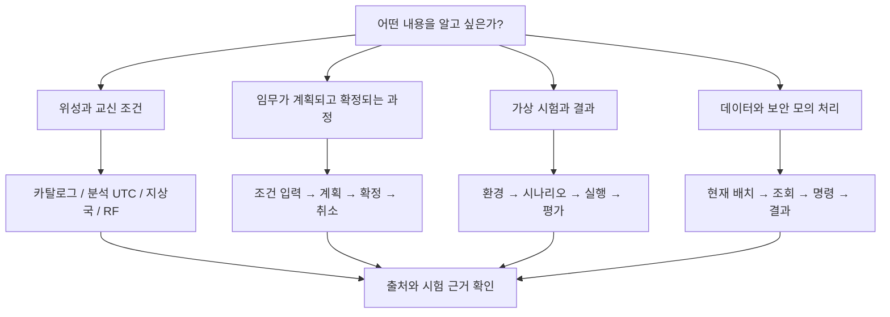
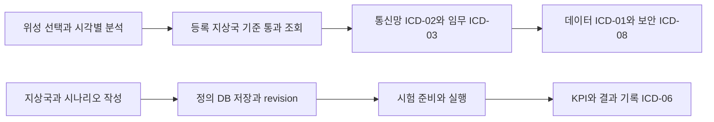

# 시작 안내와 화면 지도

이 위키는 코드를 먼저 이해하지 않아도 ISDC ODT의 화면과 처리 흐름을 따라갈 수 있도록 작성했다. 그림을 먼저 보고 필요한 설명을 읽은 뒤 관련 코드와 시험으로 들어가면 된다. 현재 구현과 시험 기록을 근거로 하며, 실제 위성 관제 시스템의 운용 인증서는 아니다.

## 먼저 볼 그림



## 화면 지도

2026-10-08 갱신에서는 최신 U035~U036 화면 배치, 작성 정의의 서버 DB 저장, ICD 실행 계약을 반영했다. 처음 협업하는 사람은 [ICD 명세와 연결 지도](interfaces/icd.md)에서 모듈 경계를 먼저 읽고, [정의 저장 구조](architecture/definition-storage.md)에서 영구 저장과 현재 실행 상태를 구분할 수 있다.

| 메뉴와 화면 | 궁금한 점 | 읽을 문서 |
|---|---|---|
| 상황판: 통합 관제 현황 | 위성과 운용 자료는 어디에서 오는가? | [위성과 지상국](screens/satellite-ground.md) |
| 상황판: DT 통합 상황판 | 가상 배치와 실행·연결 상태는 어떠한가? | [DT 시험과 설정](screens/scenarios-settings.md) |
| 위성: 위성 상태 및 궤도 | 선택 위성의 궤도를 어떻게 계산하는가? | [위성과 지상국](screens/satellite-ground.md) |
| 위성: 발사 초기 운용 | 초기 운용 절차 설명은 무엇인가? | [자료 경계](architecture/runtime-flow.md) |
| 지상국: 지상국 및 통신 | 언제 보이고 어떤 RF 조건이 필요한가? | [위성과 지상국](screens/satellite-ground.md) |
| 임무: 임무계획 및 결과 | 다섯 서비스의 입력과 작업표는 무엇인가? | [임무 계획](screens/missions.md) |
| 임무: 정상 운용 절차 / 운용 판단 및 인계 / 이상 대응 및 복구 | 절차 설명과 실제 모듈 응답을 어떻게 구분하는가? | [임무 계획](screens/missions.md) |
| 데이터: 임무 데이터 관리 | 객체·복제·복구·전달 상태는 무엇인가? | [데이터와 보안](screens/data-security.md) |
| 보안: 보안 및 명령 권한 | 어떤 모의 판정이며 언제 관측한 값인가? | [데이터와 보안](screens/data-security.md) |
| 시험: 시험 환경 구성 | 어떤 노드와 조건으로 시험하는가? | [DT 시험과 설정](screens/scenarios-settings.md) |
| 시험: 시험 시나리오 작성 | 정의를 선택하고 어떻게 검토하는가? | [DT 시험과 설정](screens/scenarios-settings.md) |
| 시험: 모의실험 실행 및 기록 | 재생·정지·배속과 사건을 어떻게 읽는가? | [DT 시험과 설정](screens/scenarios-settings.md) |
| 시험: 시험 결과 평가 | 어떤 실행의 KPI이며 무엇을 저장하는가? | [DT 시험과 설정](screens/scenarios-settings.md) |
| 시스템: 시스템 연동 설정 | 모듈·ICD·주소와 진단은 어떻게 연결되는가? | [DT 시험과 설정](screens/scenarios-settings.md) |
| 시스템: 지상 시스템 관리 / 장비 연동 시험 | 실제 관측과 장비 연동 근거가 있는가? | [검증 한계](testing/evidence.md) |
| 선택 위성 카드 / 지도 / 환경 설정 | 모델 상세, 궤적 ON/OFF, 전체 위성·공용 지구 표시를 어디서 바꾸는가? | [위성과 지상국](screens/satellite-ground.md) |
| 시스템 연동 설정 → 인터페이스 명세 | ICD-01~08은 어떤 메시지와 API를 사용하는가? | [ICD 명세](interfaces/icd.md) |
| 지상국과 내 시험 시나리오 작성 | DB 저장 완료와 편집 사본을 어떻게 구분하는가? | [정의 저장](architecture/definition-storage.md) |

메뉴는 [workspace.js](../user_application/web/scripts/workspace.js)의 현재 그룹과 이름을 기준으로 했다. 각 메뉴가 있다는 이유만으로 실장비 기능까지 구현된 것은 아니다. 고정 예시·절차 카드와 실제 연결 패널의 출처를 함께 읽는다.

## 추천하는 읽는 순서

### 최근 기능의 연결



화살표는 기능과 자료의 연결이며 앞 단계 수행만으로 다음 명령을 자동 실행하는 절차가 아니다. 실행 흐름과 보호 조건은 각 문서의 상세 도표에서 확인한다.

### 화면에서 찾아 읽기

1. 이 화면 지도에서 알고 싶은 기능을 고른다.
2. 해당 문서의 흐름도를 보고 입력과 결과를 구분한다.
3. [전체 구조](architecture/runtime-flow.md)에서 호출 경계와 상태 소유자를 확인한다.
4. [시험 근거](testing/evidence.md)에서 검증 수준과 남은 범위를 확인한다.

위키 시각화의 큰 그래프는 문서 간 이동 지도다. 버튼과 API의 실행 순서는 문서 안에 있는 Mermaid 흐름도·시퀀스도로 설명한다. 모든 문서에는 관련 코드 링크를 붙였다.

## 프로그램과 위키 열기

제품 개발 주소는 `http://127.0.0.1:8891`이다. 이미 실행 중이라면 현재 서버와 재생 상태를 보존하고 기존 화면을 이용한다. 새 서버를 시작해야 할 때의 README 명령은 다음과 같다. 저장 입력, native 계산과 PostgreSQL 준비는 현재 [README 실행 환경 안내](../README.md#실행-환경-준비)를 따른다. [프로젝트 기동 안내](../project_support/specs/001-v6-function-integration/quickstart.md)는 이전 검증 시점의 이력도 포함한다.

```powershell
# 저장소 루트에서, 기존 서버가 없는 경우
$env:ISDC_DATABASE_CONFIG = (Resolve-Path 'data/workspace/postgresql/connection.json').Path
project_support/.venv/Scripts/python -m uvicorn user_application.web.application:create_stored_orbit_app --factory --host 0.0.0.0 --port 8891
```

설치된 OpenWiki로 문서 관계 그래프와 본문을 열 수 있다.

```powershell
# 저장소 루트에서 실행
openwiki visualize openwiki --port 4321 --no-open
```

위키 서버는 제품 서버와 별개다. 그래프와 도표 라이브러리는 외부 CDN을 이용하므로 네트워크 연결이 필요하다. 정적 내보내기는 다음 명령으로 만들 수 있으며, 파일 생성과 인터넷 공개는 별도 단계다.

```powershell
openwiki visualize openwiki --export project_support/wiki_site
```

## 용어

| 용어 | 의미 |
|---|---|
| GP | 공개 궤도요소. 실제 수신 텔레메트리와 구분 |
| epoch | 궤도요소가 기준으로 삼는 시각 |
| UTC | 시간대에 의한 혼동을 줄이는 공통 시각 기준 |
| EOP | 지구 회전 및 좌표 변환 보정 자료 |
| SIM | 모의실험 |
| ICD | 모듈 사이의 인터페이스와 메시지 계약 |
| KPI | 정의된 조건에 따른 평가 지표 |
| HIL | 실제 장비를 계산 환경에 연결하는 시험. 현재 MOCK-HIL과 구분 |

코드와 실제 화면이 바뀌면 이 위키도 갱신해야 한다. 화면 출처, 계산 UTC, 단위와 검증 범위를 보존하는 것이 공유 문서의 기본 기준이다.
