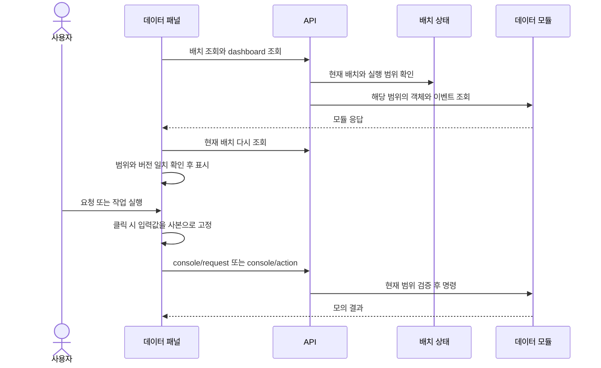
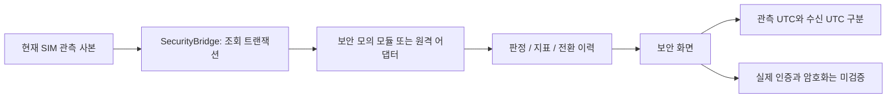

# 데이터 관리와 보안 화면

데이터 화면은 가상 배치에 속한 객체와 저장소, 처리 상태를 다룬다. 보안 화면은 SIM 관측을 보안 모의 모듈에 전달하고 판정과 이력을 보여준다. 두 화면의 정상 결과만으로 실제 파일 전달이나 실제 인증이 검증되는 것은 아니다.

## 임무 데이터 관리

메뉴 **데이터 → 임무 데이터 관리**를 연다. 원본 연결 패널에서는 객체 목록, 사본 수, 무결성 표시, 저장 계층, 이벤트와 모의 처리 추이를 확인한다. 종류, 노드, 검색어로 객체를 좁힐 수 있다.

| 조작 | 먼저 확인할 것 | 결과를 읽는 방법 |
|---|---|---|
| 상태 조회 | 현재 배치와 모듈 연결 | 객체가 없는 상태와 조회 실패를 구분한다 |
| 객체 선택 | 선택 객체가 현재 배치에 존재하는지 | 크기, 출처, 사본, 무결성, 상태를 함께 읽는다 |
| 서비스 요청 | 현재 객체 또는 종류, 필터, 전달 대상 | 모의 요청 결과이지 실제 이용자 수신 확인이 아니다 |
| 데이터 작업 | 현재 저장소/객체와 작업 조건 | 정책 설정과 실제 객체에 대한 모의 운영 조건을 구분한다 |

화면에 있는 복제·복구 및 정책 관련 조작은 같은 입력 조건에서 모두 허용되는 것이 아니다. 조회되지 않은 배치, 오류가 남은 응답, 운영할 객체가 없는 경우에는 관련 작업을 제한한다. 현재 패널 구현은 화면이 열려 있을 때 약 3초 간격으로 조회하며, 다른 화면으로 이동하면 폴링과 대기를 정리한다.

`scope_id`는 데이터가 속하는 실행 범위다. 패널은 배치 버전과 노드 목록을 비교하고, 모듈의 `isolated-v1` 범위 계약을 확인한다. 조회 중 배치가 바뀌면 정상 결과로 표시하지 않고 재조회를 요구한다. 다른 실행의 객체가 현재 실행 결과처럼 섞이는 것을 막는 장치다.

근거: [source_data.js](../../user_application/web/scripts/tabs/source_data.js), [데이터 HTTP 경로](../../communication/http/data_management.py), [화면 수명주기 시험](../../project_support/tests/browser/source_data_panel.test.mjs).

## 보안 및 명령 권한

메뉴 **보안 → 보안 및 명령 권한**을 연다. 원본 ICD-08 패널은 현재 모의 판정, 모의 인증률, 처리량, 손실률, 판정 변경 이력을 표시한다. 화면 진입 및 가시성 복귀 때 조회하고 사용자가 조회 버튼으로 갱신할 수도 있다.

관측 UTC는 모듈 자료의 기준 시각이고 수신 UTC는 화면이 응답을 받은 시각이다. 새 응답을 받았다고 해서 오래된 관측값까지 현재 자료가 되는 것은 아니다. 응답 시간 초과, 실행 변경, 화면 숨김과 종료에 대한 취소·현재성 처리가 있다.

파일 무결성과 PQC-TEE 표시는 실제 파일이나 장치를 검증했다는 뜻이 아니다. 패널은 최근 전환을 표시하며 영구 보안 감사 로그를 제공한다고 해석하면 안 된다. 화면에 보존된 운용 절차 예시는 원본 모듈의 실제 응답과 별도로 읽는다.

근거: [source_security.js](../../user_application/web/scripts/tabs/source_security.js), [security.py](../../communication/http/security.py), [보안 관측 시험](../../project_support/tests/browser/source_security_observation.test.mjs).

## 다른 화면과의 연결

## 최신 화면 정리와 ICD

U036에서는 원본 모듈 보고와 데이터 정책 JSON을 접힌 상세로 옮겼다. 기본 화면은 안정성·처리 단계·저장 노드·객체·운영 조치부터 읽고, 원본 값이나 처리 시각이 필요하면 상세를 펼친다. 접힘은 표시 방식이며 scope 검사나 명령 조건을 줄이지 않는다.

데이터는 **ICD-01**, 보안은 **ICD-08**을 사용한다. 메시지와 API, SIM 경과 초와 UTC, scope/run 식별자의 차이는 [ICD 명세](../interfaces/icd.md)를 참고한다. 최근 전체 UI 점검은 빈 결과와 현재 표시를 확인한 범위이며 새 저장 명령이나 장애를 실행해 결과를 만든 시험이 아니다.

근거: [현재 데이터 패널](../../user_application/web/scripts/tabs/source_data.js), [U036 실화면 기록](../../project_support/docs/validation/u036_workspace_ui_audit.md).

배치와 임무 조건이 바뀌면 데이터 운영의 전제도 달라진다. [임무 계획](missions.md)을 먼저 확인하고, 모듈 주소와 연결 방식은 [시스템 설정](scenarios-settings.md)에서 확인한다. 실제 화면 수용과 구성요소 시험의 차이는 [시험 근거](../testing/evidence.md)에 정리했다.
