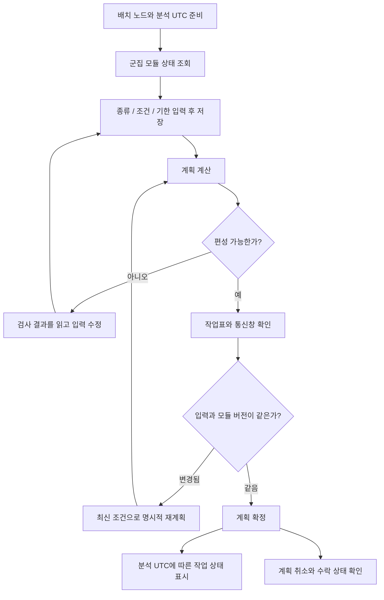
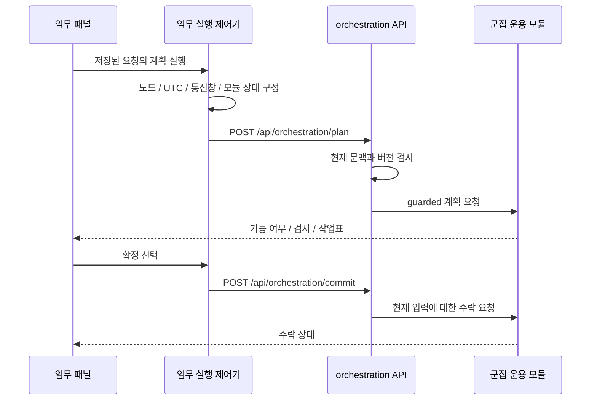

# 임무 계획과 확정 흐름

메뉴 **임무 → 임무계획 및 결과**에서 군집 서비스 임무를 다룬다. 현재 화면 매핑에서 이 편집 패널은 `mission` 화면에만 배치된다. 정상 운용 절차, 운용 판단 및 인계, 이상 대응 및 복구 화면의 설명 카드를 같은 계산 기능으로 해석하지 않는다.

## 어떤 임무를 만들 수 있는가

| 종류 | 입력의 핵심 | 계산하려는 것 |
|---|---|---|
| 관측 인도 | 관측 지점, 데이터 크기, 처리 여부, 기한 | 촬영부터 처리와 지상 인도까지 가능한 일정 |
| 궤도상 연산 | 데이터 보유 위성, 입력 크기, 출력 비율 | 궤도에서 처리하고 결과를 전달하는 일정 |
| 중계 전송 | 출발, 도착, 데이터량, 지연 조건 | 통신 경로와 접속창을 이용한 전달 |
| 외부 위성 데이터 수신 | 외부 카탈로그 위성, 거리와 수신 속도 가정 | 가까이 지날 때 모의 수신하고 인도하는 일정 |
| 군집 소프트웨어 갱신 | 대상 위성, 이미지 크기, 적용 시간, 동시 갱신 수 | 배포 및 적용의 모의 일정 |

속도와 장비 능력은 모델 가정이다. 실제 촬영, 외부 기관 교차링크, 원격 소프트웨어 갱신을 수행했다는 의미는 아니다.

## 먼저 준비할 것

시험 환경에서 노드를 배치하고 분석 시계를 정지한다. 임무 화면에서 군집 모듈 상태를 조회하고 요청 이름, 종류, 시작 시각, 기한, 세부 조건을 저장한다. 저장되지 않은 편집값이 있으면 계획이나 확정 전에 저장을 요구한다. 다른 창이 요청을 바꾼 경우 변경 내용을 먼저 불러온다.

**계획**은 가능한 작업 후보를 계산하는 단계이고, **확정**은 그 계획을 모듈이 수락하는 단계다. 편성 불가 결과도 정상적인 계산 결과일 수 있다. 빈 작업표를 성공으로 해석하지 않는다.

## 코드에서는 어떻게 이어지는가

API의 보호 경로는 모듈 인스턴스와 sequence/version, 수락한 분석 UTC와 노드·지상국 조건을 검사한다. 이전 계획을 다른 현재 상태에서 무조건 확정하지 않기 위한 검사다. 최신 조건 재계획은 이러한 검사를 해제하는 버튼이 아니다.

## 결과를 읽는 순서

## 최신 화면에서 두 임무 기능을 구분하기

U036 화면 점검에서는 군집 서비스 임무와 기존 SIM 임무 편집기를 모두 유지했다. 군집 계획은 실제 UTC와 계산한 창을 사용하고, SIM 편집기는 0~100 축의 모의 임무를 다룬다. 비슷한 이름이 있어도 같은 작업의 중복 화면으로 합치면 입력 기준을 잃는다.

군집 모듈에 보내는 OR-01 계획, OR-02 결과, OR-03 확정·중단과 OR-04 상태의 API와 보호 헤더는 [ICD-03 실행 계약](../interfaces/icd.md#icd-03-계획을-제안하고-언제-확정하는가)에 정리했다. 새 UI 점검 기록은 현재 화면 표시 범위이며 다섯 임무 종류 전체를 새로 실행했다는 증거가 아니다.

근거: [U036 기능 구분](../../project_support/docs/validation/u036_workspace_ui_audit.md).

## 작업표를 읽는 순서

1. 요청 종류와 계산 UTC, 계획 버전을 확인한다.
2. 가능 여부와 실패한 검사를 읽는다.
3. 위성별 일정표, 접속창, 관측창, 작업 시작·종료 UTC와 기한을 비교한다.
4. 작업 행을 선택해 상세 조건을 확인한다.
5. 확정 상태와 현재 분석 시각을 확인한다. 작업 진행 표시는 실제 장비 수행 증거와 다르다.

근거: [임무 종류](../../digital_twin/model_library/browser/mission_types.js), [패널과 일정표](../../user_application/web/scripts/tabs/source_missions.js), [실행 제어기](../../user_application/web/scripts/missions/mission_execution.js), [HTTP 보호 경로](../../communication/http/orchestration.py).

종류와 상태 경계는 [source_mission_types.test.mjs](../../project_support/tests/browser/source_mission_types.test.mjs) 등에서 시험한다. 다섯 종류 모두의 실제 브라우저 복구와 성공 수용이 끝났다고 주장하는 문서는 아니다. 남은 검증은 [시험 근거](../testing/evidence.md)를 참고한다. 데이터 전달 후속 설명은 [데이터 관리](data-security.md)로 이어진다.
