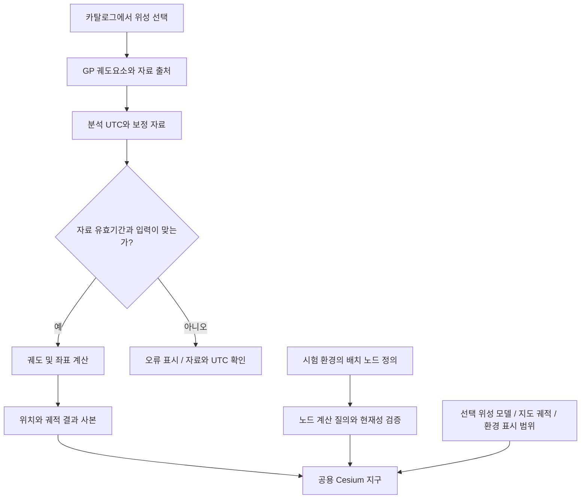
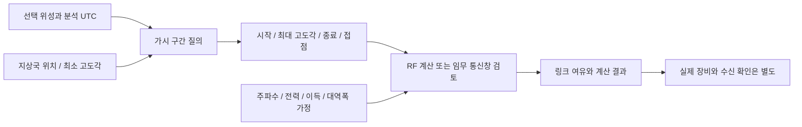
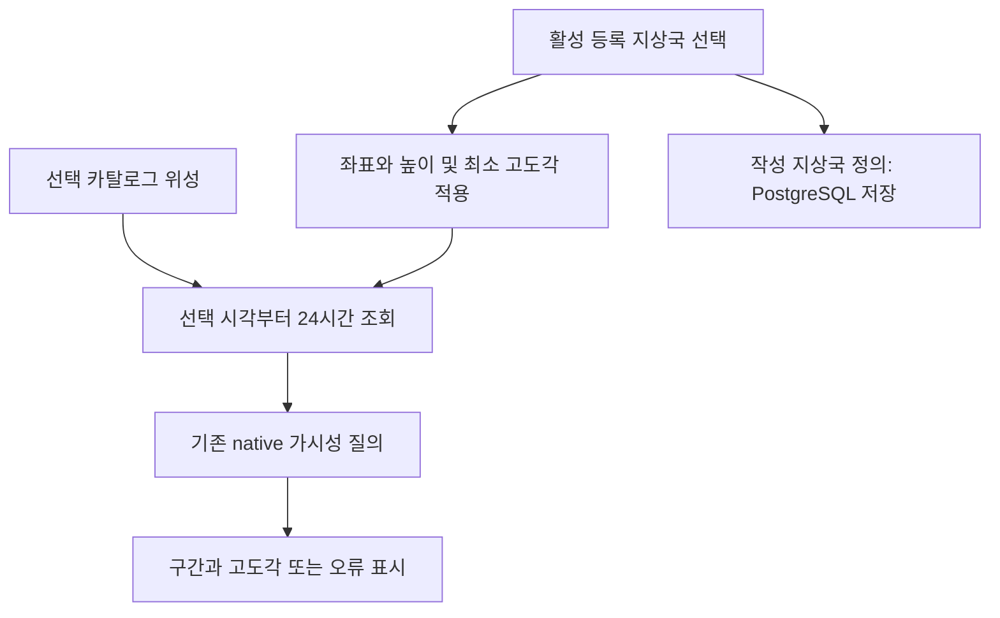
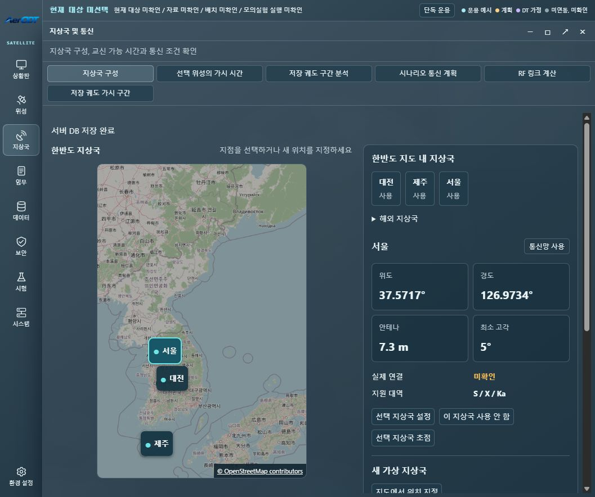

# 위성과 지상국 화면

위성 화면에서 선택하는 카탈로그 위성과 시험 환경에 배치하는 가상 노드는 출처가 다르다. 같은 지구 위에 보이더라도 카탈로그 GP 궤도요소와 배치 노드 정의를 구분한다. GP는 공개 궤도요소 자료이며 실측 원격측정이 아니다.

## 화면별 역할

| 메뉴 | 역할 | 연결된 자료 |
|---|---|---|
| 상황판 → 통합 관제 현황 | 위성 및 운용 상태 요약 | 실제 원격측정이 없는 수치는 미확인 |
| 위성 → 위성 상태 및 궤도 | 카탈로그 선택과 궤도 자료 탐색 | 저장 입력 또는 선택 GP와 계산 결과 |
| 지상국 → 지상국 및 통신 | 지상국, 접속창, RF 및 노드 통신망 | 기하 계산과 모의 통신 결과 |
| 시험 → 시험 환경 구성 | 노드 정의와 가상 배치 | 가상 위성 및 장비 모델 |
| 선택 위성 카드 상세 | 해당 위성의 모델 표현 | 기존 모델 선택 소유자 |
| 지도 궤적 버튼 | 선택 위성의 궤적 ON/OFF | 기존 궤적 소유자 |
| 환경 설정 | 공용 지구 표시와 전체 위성 표시 | 표시 범위와 화면 설정 |

U035~U036에서는 모델 표현을 선택 위성 카드 상세로, 궤적 ON/OFF를 지도 버튼으로 옮겼다. 전체 위성 표시는 환경 설정의 공용 지구 설정 안의 체크박스이며 기본 기준은 현재 시각이다. 독립 고급 탭은 노출하지 않는다. 발사 초기 운용 화면의 절차 설명은 실제 발사·교신 완료 기록이 아니다.

최신 U018 검토에서는 통합 관제 현황의 중앙에 공용 Cesium 지구, 좌우에 운용 수치와 상태를 배치했다. DT 상황판은 중앙 모듈 연결 SVG와 좌우 시나리오·결과 요약으로 구성한다. 작은 화면에서는 요약 패널을 하단으로 옮기며 기존 상태 소유자는 유지한다.

## 위성의 위치가 지구에 나타나는 과정

화면 하단 시간창은 현재 시각과 분석 시각을 구분한다. 분석 시각은 해당 계산 자료의 시계이며 실제 관제 현재 시각과 동일한 의미가 아니다. 전체 위성 표시에서는 계산 스냅샷의 분석 UTC와 재생 표시 UTC를 구분하고 현재 출처와 일치하는지 확인한다. 화면 애니메이션이 움직인다고 새 정밀 계산이 매 프레임 완료됐다는 뜻은 아니다.

EOP는 지구 회전과 좌표 변환에 쓰는 보정 자료다. 현재 UI 검토 기록에는 저장 자료의 기간을 벗어난 UTC 오류와 자료 갱신 필요가 남아 있다. 유효기간 검사를 해제하거나 오류를 성공값으로 바꾸는 대신 적용된 입력 자료를 확인해야 한다.

코드 근거: [화면 조립](../../user_application/web/scripts/workspace_orbit.js), [전체 위성 시간 결합](../../user_application/web/scripts/catalogue_scene_time_binding.js), [궤도 API](../../communication/http/orbit.py), [노드 계산 API](../../communication/http/node_geometry.py).

## 지상국에서 언제 교신할 수 있는가

지상국 위치는 위도·경도와 타원체 높이로 지정한다. 최소 고도각은 위성이 지평선보다 얼마나 높아야 허용할지 정하는 조건이다. 조회 구간의 가시성은 궤도 모델로 계산한 기하학적 조건이며 장비 수신 성공의 증거가 아니다.

현재 선택 카탈로그 위성의 통과 분석은 지상국 화면에 있다. 활성 등록 지상국을 명시적으로 선택하면 해당 위도·경도·타원체 높이·최소 고도각을 기존 시각 소유자에 적용하고 선택 시각부터24시간을 조회한다. 저장 궤도, 배치 위성, 시나리오 통신 계획은 다른 입력을 쓰므로 별도 이름과 화면으로 구분한다. 접속창 없음, 조회 구간 잘림과 계산 오류도 구분한다.

지상국은 지도와 선택 지상국을 먼저 읽고 목록·저장 관리, 배치 위성 통신 분석의 상세는 필요할 때 펼친다. 위성 선택과 지상국 분석은 저장 정의를 실행 배치와 혼동하지 않도록 분리한다.

근거: [U035 표시 제어](../../project_support/docs/validation/u035_display_controls.md), [U036 전체 UI 점검](../../project_support/docs/validation/u036_workspace_ui_audit.md). 화면 캡처는 해당 변경 체크포인트의 근거다.

RF-Friis-v1 계산기는 주파수, 거리, 송신 전력, 안테나 이득과 손실 등의 조건에서 결과를 계산한다. ISS APRS 조건은 출처가 있는 일부 주파수 조건과 사용자 장비 가정을 구분한다. 통신망 패널은 지상국·OISL 모델, 경로와 DTN 결과, 통신 모듈 상태를 연결한다. 모듈로 보내는 동작과 단순 지구 표시를 동일하게 취급하지 않는다.

근거: [지상 통신 패널](../../user_application/web/scripts/tabs/ground_network.js), [RF 계산 패널](../../user_application/web/scripts/tabs/rf_link_budget.js), [RF와 경로 API](../../communication/http/rf_network.py), [카탈로그 통과 패널](../../user_application/web/scripts/tabs/catalog_passes.js).

## 확인할 순서

1. 선택 자료가 카탈로그인지 배치 노드인지 확인한다.
2. 분석 UTC와 궤도요소 epoch, 보정 자료의 유효기간을 확인한다.
3. 지상국과 최소 고도각을 정하고 가시 구간을 계산한다.
4. RF 결과의 입력 가정과 단위를 읽는다.
5. 실제 수신·장비·HIL 증거가 있는지는 별도로 확인한다.

모델 선택지와 GPU에서의 모든 자산 정상 렌더링, 많은 노드의 목표 프레임 성능은 서로 다른 검증 항목이다. 상세 범위는 [시험 근거](../testing/evidence.md), 통신창을 쓰는 계획 흐름은 [임무 문서](missions.md)를 참고한다.
