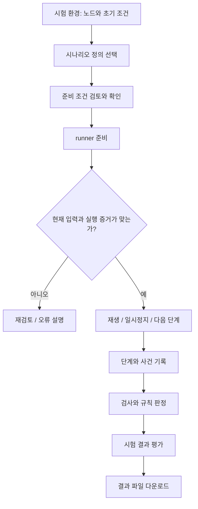
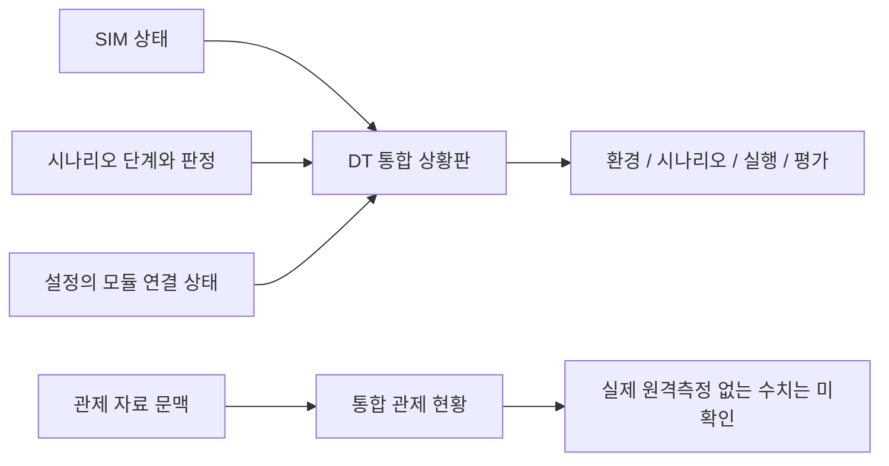
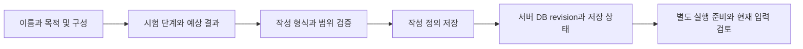
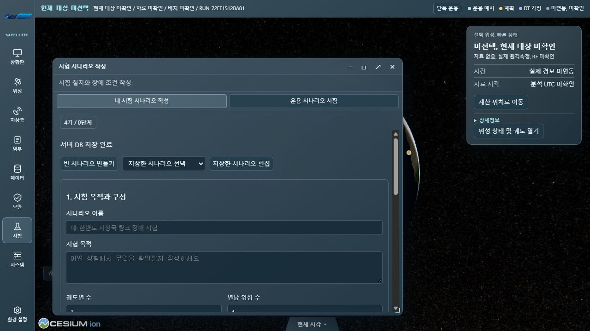
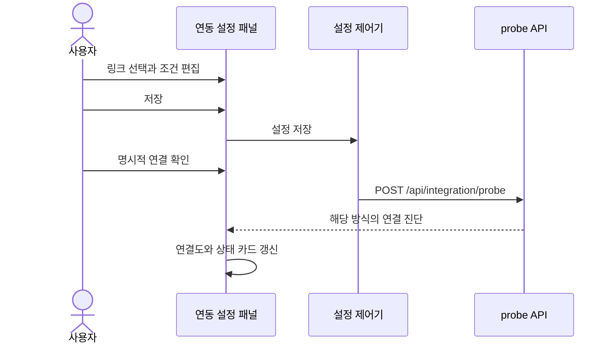

# DT 시험과 시스템 설정

시험은 환경을 구성하고 시나리오를 검토한 뒤 실행하고 결과를 평가하는 순서로 읽는다. 현재 UI는 이 네 책임을 서로 다른 화면에 배치한다. 시나리오의 성공 판정은 정의된 모의 조건에 대한 판정이며 실제 위성 운용 성공을 뜻하지 않는다.

## 화면별 역할

| 화면 | 하는 일 | 다음 화면과의 연결 |
|---|---|---|
| DT 통합 상황판 | 가상 배치, 실행 경과, 배속, 단계와 모듈 상태 요약 | 각 작업 화면으로 이동 |
| 시험 환경 구성 | 노드 및 초기 시험 조건 구성 | 시나리오의 입력 조건 |
| 시험 시나리오 작성 | 내 시험 정의 작성·저장과 기존 운용 시나리오 검토 | 정의와 현재 입력을 구분 |
| 모의실험 실행 및 기록 | 서버 SIM 제어와 시나리오 재생, 사건 기록 | 평가할 실행과 사건 |
| 시험 결과 평가 | KPI, 조건 판정, 비교 및 결과 저장 | 같은 실행의 결과 문서 |
| 시스템 연동 설정 | 모듈 연결도, ICD, 주소와 진단 | 실행에 사용할 연결 설정 |
| 환경 설정 | 표시·테마 및 공용 지구 관련 설정 | 화면 표현과 표시 범위 |

시나리오 단계의 시간 진행과 서버 SIM 재생 제어는 연결돼 있지만 동일한 객체는 아니다. 원본 시나리오 runner는 단계와 검사를 관리하고 SIM 제어기는 서버 스트림과 실행 명령을 관리한다. 두 실행의 식별자와 현재 입력이 맞는지 확인해야 한다.

## 시나리오 실행 흐름

완료된 시나리오를 현재 입력과 다시 대조하는 기능은 과거 판정을 새 입력의 성공으로 바꾸는 기능이 아니다. 준비·재생·정지·종료·입력 변경 상태에 따라 허용되는 조작이 다르다. 다른 화면에 있을 때도 실행 상태를 보여주는 작은 도크가 있어 해당 실행의 제어와 결과 화면으로 이어질 수 있다.

시나리오 결과 저장은 runner의 기록과 판정에서 이루어진다. 서버 KPI의 JSON/CSV 내보내기와 시나리오 기록 다운로드는 서로 다른 파일 경로다. 둘 중 한 파일의 바이트 검증을 다른 파일의 검증으로 대신할 수 없다.

근거: [시나리오 패널](../../user_application/web/scripts/tabs/source_scenarios.js), [SIM 패널](../../user_application/web/scripts/tabs/sim_workspace.js), [KPI 패널](../../user_application/web/scripts/tabs/kpi_workspace.js), [서버 보고서](../../communication/http/reports.py).

## DT 상황판과 관제 상황판의 차이

DT 상황판의 연결 수는 통신 연결 근거다. 모듈 계산 정확도나 실제 위성 상태의 인증으로 읽지 않는다. 관제 상황판에는 가상 시험 수치를 실제 운용 수치로 넣지 않는다는 경계가 있다.

## 시스템 연동 설정

## 직접 작성하는 시험 정의

현재 작성 패널은 이름·목적·위성 구성·지상국과 시간순 시험 단계를 저장한다. 단계는 상태 관측, 장애 주입, 복구 확인, 결과 비교로 구분하며 장애 종류·대상·지속 시간·기대 결과를 적는다. 정의 저장은 실제 runtime 장애 주입과 다르다. 작성 정의만으로 실험 성공이나 자동 실행을 주장하지 않는다.

저장 가능한 초안은 최대48개이고 단계는 최대128개다. [작성 코드](../../user_application/web/scripts/scenario/authoring.js)는 정의 사본을 반환하며 다른 창의 저장 변경을 검사한다. 서버 DB가 활성화되면 지상국과 작성 정의의 저장을 [PostgreSQL 저장 어댑터](../architecture/definition-storage.md)가 연결한다. 실행 결과와 텔레메트리는 이 정의 DB에 저장하지 않는다.

## 연동 설정의 실제 조작

연결도를 보고 링크를 선택하면 전송 방식, 주소, timeout 및 관련 운용 설정을 편집한다. 저장과 초기화, 전체/개별 연결 확인은 서로 다른 동작이다. 편집한 주소가 곧바로 연결 성공을 의미하지 않으며 명시적으로 실행한 진단 결과를 읽어야 한다.

TCP 연결, UDP 주소 확인, 모듈 계약 조회는 서로 다른 증거다. 통신 진단 통과를 보안 인증·RF 수신·실제 HIL 성공으로 확대하지 않는다. ICD는 모듈 사이 메시지와 인터페이스 계약을 설명하는 자료다.

8개 ICD의 방향, 메시지, 실제 API와 계획 항목은 [ICD 인터페이스 명세](../interfaces/icd.md)에 정리했다. U036에서는 시스템 연동의18개 모듈,17개 연결,8개 인터페이스 상세를 펼쳐 확인했다. 이는 상세 접근과 표시 확인이며 실제18개 독립 제품이 연동된 결과가 아니다.

설정의 저장되지 않은 편집값과 다른 창 변경은 충돌 처리 대상이다. 화면 이동과 별도 창 사이의 초안 전달이 있다고 해서 전체 다중창 복구 수용이 모두 완료된 것은 아니다. `facility`와 `em` 화면도 실제 시설·장비 관측이 연결됐는지 별도로 확인해야 한다.

근거: [설정 패널](../../user_application/web/scripts/tabs/source_settings.js), [연결 진단](../../communication/http/integration.py), [상황판 표현](../../user_application/web/scripts/workspace_wall_summary.js).

연결의 전체 구조는 [아키텍처](../architecture/runtime-flow.md), 검증 범위와 미완료 항목은 [시험 근거](../testing/evidence.md)를 참고한다.
