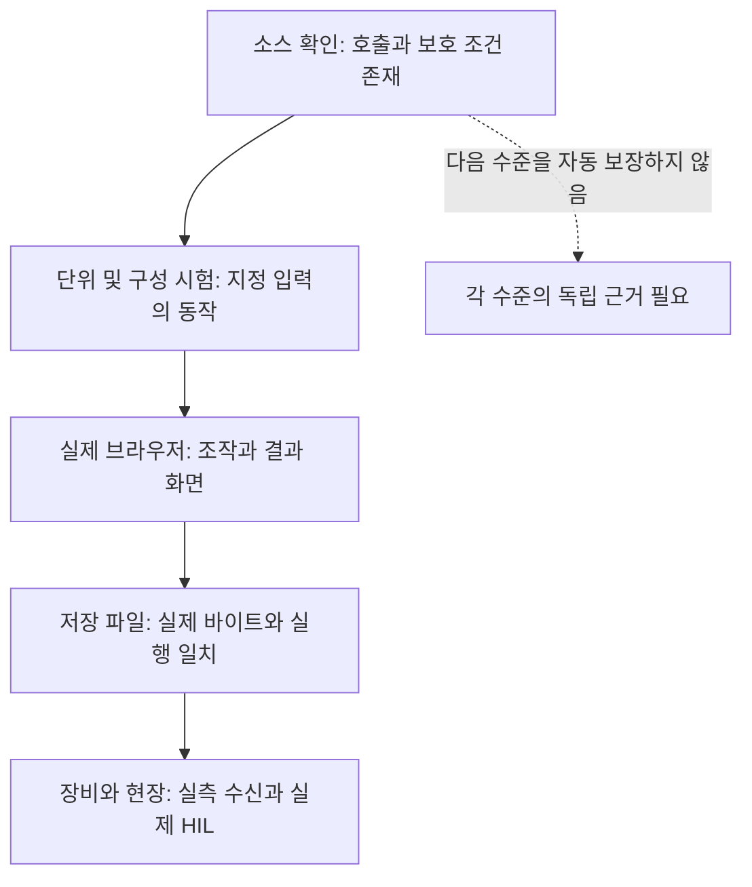

# 시험 근거와 남은 한계

이 위키는 2026-10-07에 처음 만들고 2026-10-08 현재 구현과 ICD를 다시 확인해 갱신했다. 커밋되지 않은 화면·저장·시험 수정도 포함한 작업트리 설명이다. 문서의 갱신 시각만으로 모든 제품 수용이나 실장비 검증이 끝났다고 해석하지 않는다. 이전 작성의 시험은 아래에서 과거 체크포인트로 보존한다.

## 증거 수준



이 그림은 증거 범위의 차이를 설명한다. 단위시험을 많이 통과해도 실제 장비 검증까지 끝난 것은 아니다. 코드가 구현됐는지, 브라우저에서 동작했는지, 요구 수용이 완료됐는지는 나눠 읽는다.

## 2026-10-08 갱신에서 직접 실행한 시험

| 실행 | 결과 | 범위 |
|---|---|---|
| Node 집중5파일 | 46 통과, 실패·생략0, 172.62ms | ICD 카탈로그, 설정 제어, 정의 DB 브라우저 어댑터, 통과 패널과 데이터 상세 |
| 전체 Python pytest | 963 통과,10 생략,2 실패,8 경고,338.12s | 현재 프로젝트 가상환경. 제품 wheel 누락으로 설치 검사2건 실패 |
| 기존 wheel 지정 후 설치 파일 재검증 | 3 통과,1 경고,9.17s | 기존0.3.0 wheel의 기록·라이선스와 격리 설치/native 호출 |

전체 Python의 두 실패는 이전 작성 때와 같은 `test_orbit_install.py`의 wheel 검색 문제였다. 아래 기존 wheel 경로를 명시해 해당 파일만 다시 실행했다. 전체 시험을 모두 다시 통과했다고 합산하지 않는다. DB 및 native 전용 조건이 없는 시험의 생략은 미실행이며 성공 증거가 아니다. 이번 작업에서는 운영 DB에 쓰거나 제품 서버를 재시작하지 않았다.

```powershell
node --test project_support/tests/browser/source_topology.test.mjs project_support/tests/browser/source_settings_controller.test.mjs project_support/tests/browser/workspace_configuration.test.mjs project_support/tests/browser/catalog_passes.test.mjs project_support/tests/browser/source_data_detail.test.mjs
project_support/.venv/Scripts/python -m pytest -q
```

실행 로그는 로컬 검증 산출물 `validation-20261008`의 `node.log`, `pytest.log`, `install.log`다. 공유 사이트에는 자동 포함하지 않는다.

## 최신 저장소 기록과 실제 화면 점검

[U036 전체 UI 점검](../../project_support/docs/validation/u036_workspace_ui_audit.md)은 Python967통과/8생략/8경고와 Node2195통과/1생략을 기록한다. 이는 해당 UI 변경의 기록이며 이번 직접 실행 결과와 구분한다.8개 메뉴 그룹·환경 설정과18모듈·17연결·8인터페이스 상세를 실제로 펼쳐 확인했다. 새 배치·시험 실행·장애·명령·설정 저장을 만들어 모든 상태 행렬을 검증한 기록은 아니다.

[U035](../../project_support/docs/validation/u035_display_controls.md)는 전체 위성 표시 ON/OFF와 등록 지상국 기준의 선택 위성 통과5구간/0오류를 실제 화면에서 확인했다. [U029](../../project_support/docs/validation/u029_idle_performance.md)의 정지 반복 알림·복제 감소는 로컬 미세 측정이며 실제 RAF p95는19.0→18.9ms로16.7ms 수용 기준을 통과하지 않았다. 성능 최적화를 GPU 목표 완료로 확대하지 않는다.

ICD의 구현·모의·계획 범위는 [인터페이스 명세](../interfaces/icd.md)에, 실제 정의 DB의 저장·백업 복원 기록과 범위는 [저장 구조](../architecture/definition-storage.md)에 연결했다. PostgreSQL 관련 자동 시험은 명시적 시험 연결이 없으면 생략한다.

## 최초 작성에서 실행한 집중 시험

다음 8개 파일의 29개 시험은 모두 통과했다. 실패, 건너뜀, 취소는 0개였으며 실행 시간은 약 0.53초였다. DOM fixture를 포함한 Node 시험이며 실제 브라우저 캡처 시험으로 부르지 않는다.

```powershell
node --test project_support/tests/browser/operator_summary.test.mjs project_support/tests/browser/workspace_domain_navigation.test.mjs project_support/tests/browser/workspace_navigation_ownership.test.mjs project_support/tests/browser/source_mission_types.test.mjs project_support/tests/browser/source_data_panel.test.mjs project_support/tests/browser/source_security_observation.test.mjs project_support/tests/browser/source_settings_controller.test.mjs project_support/tests/browser/source_scenario_review.test.mjs
```

| 묶음 | 확인한 내용 |
|---|---|
| 운영 요약 | 진행률을 성공 판정으로 오해하지 않고 미확인 단위를 보존 |
| 화면 탐색과 소유권 | 보안 메뉴, 환경 설정의 단일 표시 설정 소유권 |
| 임무 | 다섯 종류, 장비 능력, 분석 시각에 따른 작업 상태 |
| 데이터 | 미조회 상태에서 명령 차단과 패널 수명주기 |
| 보안 | 조회 순서, 화면 숨김, 시간 초과, 늦은 응답 거부 |
| 연동 설정 | 명시적 설정·probe, 편집 충돌 및 오래된 성공 거부 |
| 시나리오 | 현재 정의 검토, 기록 복원과 명시적 재개, 분석 따라가기 |

## 저장소에 남아 있는 전체 시험과 실화면 기록

### 2026-10-07 전체 Python 실행과 환경 보완

이번 위키 작업에서는 프로젝트 가상환경으로 전체 `pytest -q`도 실행했다. 결과는 958개 통과, 8개 건너뜀, 2개 실패, 경고 8개였고 307.40초가 걸렸다. 두 실패는 `test_orbit_install.py`의 wheel 검사와 깨끗한 가상환경 설치 검사에서 제품 wheel을 찾지 못한 경우였다. 문서 변경으로 생긴 계산 회귀라고 단정하지 않는다.

이후 기존 `ISDC_ODT` 저장소에 보존된 `20261005_230855_957/isdc_orbit_propagation-0.3.0-cp314-cp314-win_amd64.whl`을 `ISDC_ORBIT_INSTALL_WHEEL`로 명시해 해당 시험 파일을 다시 실행했다. 세 시험 모두 통과했고 경고 1개, 9.96초였다. 새 native 빌드나 운영 환경 설치는 하지 않았으며, 시험이 만든 별도 가상환경만 사용했다. 전체 시험의 첫 실패와 이 환경 보완 후 집중 통과는 별도 결과다. 전체 시험을 다시 모두 통과했다고 합산해서 표현하지 않는다.

```powershell
$env:ISDC_ORBIT_INSTALL_WHEEL=(Resolve-Path '<검증한 제품 wheel 경로>').Path
project_support/.venv/Scripts/python -m pytest -q project_support/tests/test_orbit_install.py
```

실행 로그는 로컬 검증 산출물 `validation-20261007`의 `pytest.log`와 `install.log`에 보존했다. 이 로컬 검증 자료는 공유 사이트에 포함된 파일은 아니다. UI U018 검토 기록에는 별도로 전체 Node 2,146개 통과와 1개 생략이 추가됐으며 이는 해당 UI 변경 체크포인트의 기록이다.

현재 [README](../../README.md)는 U037의 Python 967개 통과, 8개 건너뜀, 8개 경고와 U038의 JavaScript 2,195개 통과, 1개 건너뜀을 기록한다. 각 실행 시점의 회귀 결과이며 실제 장비, 전체 모델 GPU, 성능과 다중창 수용의 완료를 뜻하지 않는다. 이 단락은 위의 과거 위키 작업 실행과 구분해 읽으며, 더 오래된 숫자는 개발 로그의 과거 경과로 읽는다.

[실제 실행 기록](../../project_support/specs/001-v6-function-integration/validation/t081_live_continuation_20261007.md)에는 원본 시나리오 실행, 구성요소 결과와 실제 다운로드 파일의 바이트 확인이 구분돼 있다. 특정 VF-03 파일의 검증을 모든 보고서·다운로드 성공으로 확대하지 않는다.

[UI 요청 이행 점검](../../project_support/docs/validation/ui_request_completion_review.md)은 최근 메뉴·시간창·상황판·제어 소유권 개편과 화면 확인을 기록한다. 문구와 배치 확인은 모델 물리 정확성의 시험이 아니다.

## 남아 있는 수용 범위

현재 감사 기록의 남은 항목을 기준으로 읽으며 과거 표의 미완료를 현재 코드 부재로 단정하지 않는다.

| 영역 | 현재 읽을 수 있는 근거 | 별도 확인이 필요한 범위 |
|---|---|---|
| 위성·모델 | 계산, 매핑, 일부 자산 GPU 캡처 | 전체 자산 외관, 두 해상도 수용, 대규모 프레임 목표 |
| 통신 | 기하·RF·경로와 모듈 연계 코드 및 시험 | 현재 실화면 실패/복구 행렬, 실제 RF 수신 |
| 임무 | 다섯 종류와 보호 계획/확정/취소 | 다섯 종류 전체의 실제 성공·복구 수용 |
| 데이터·보안 | 배치 범위와 모의 모듈 흐름 | 실제 운영 명령 행렬, 실제 인증·암호화·장비 |
| 공유 상태 | 현재 시각·선택·문맥 검사 | 전체 다중창 인계와 복원 수용 |
| 시간 자료 | 계산 유효기간 검사 | 최신 EOP 확보와 출처 검증 |
| 제품 연계 | 독립 저장소 구조 | 향후 AerODT 연계와 실제 HIL |

근거: [현재 요구별 감사](../../project_support/specs/001-v6-function-integration/validation/t075_t083_current_requirement_audit.md). 새 결과가 나오면 해당 실험 조건, 입력, 커밋 또는 작업트리 범위와 함께 이 표를 갱신한다.

## 위키를 갱신하는 기준

현재 화면 메뉴나 소유 패널, API 계약, UTC 의미, 모듈 범위, 시험 수용 결과가 바뀌면 관련 문서를 갱신한다. OpenWiki의 코드 근거 연결은 자료 변경을 추적하는 장치이며 설명이 항상 참이라는 인증은 아니다. 도표의 화살표가 실제 호출과 맞는지, 모의 결과를 실측처럼 적지 않았는지를 함께 확인한다.
